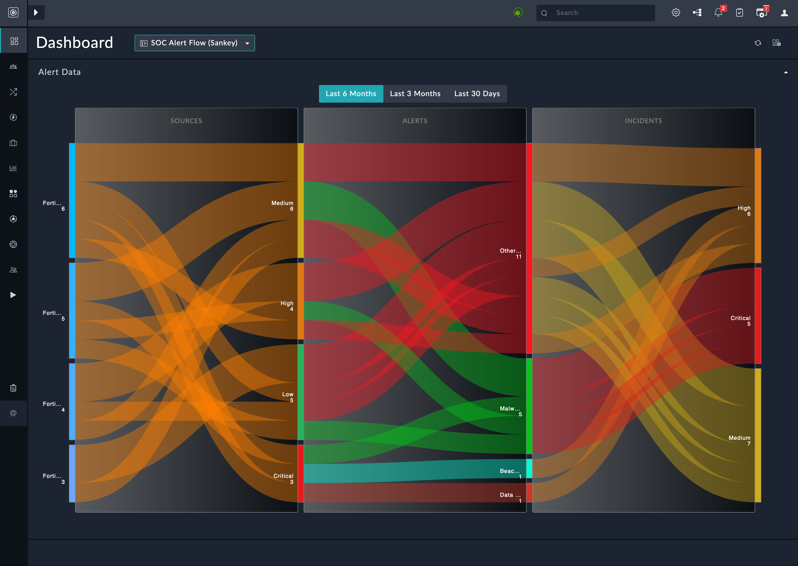

# Release Information

* **Version**: 1.0.0
* **Certified**: No
* **Publisher**: Fortinet
* **Compatible Version**: FortiSOAR v7.4.2 and later

# Overview

The **Sankey Visualizer** solution pack creates a dashboard using information from the *SOC Overview Sankey* Widget. 

At a glance, you can view the overall flow of data related to the various modules like alerts and escalated incidents from various sources. 

Following is an example of the dashboard with demo records

Information such as the following can be viewed:

**Data Flow:** Alert Source -> Alert Severity -> Alert Type -> Escalated Incident Severity

- **Alert Source**: This node represents the sources of alerts, such as FortiSIEM, FortiManager, FortiNDR and FortiAnalyzer.
- **Alert Severity**: The flow from the Alert Source node splits into different branches based on the severity of the alerts. 
- **Alert Type**: Each branch further splits based on the type of alert generated.
- **Incident Severity (Incidents Escalated from Alert)**: Finally, the flow from the Alert Type node leads to incidents that have been escalated from the alerts. These incidents are classified based on their severity.

# Next Steps

| [Installation](./docs/setup.md#installation) | [Configuration](./docs/setup.md#configuration) | [Usage](./docs/usage.md) | [Contents](./docs/contents.md) |
|----------------------------------------------|------------------------------------------------|--------------------------|--------------------------------|
